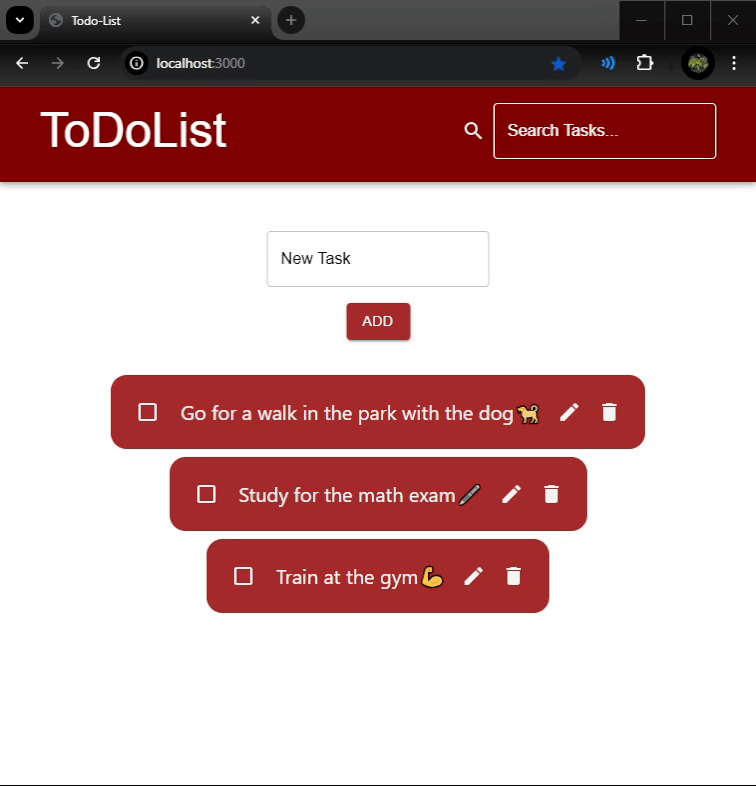

# To-Do List App (React + Material-UI + Spring Boot + MySQL)


This project is a To-Do List Application built using React and Material-UI (MUI) for the frontend and Spring Boot for the backend. Tasks are stored in a MySQL database. 

It allows users to:
- View a list of tasks
- Add new tasks
- Update existing tasks
- Delete tasks
- Mark tasks as completed
- Search for tasks

Tasks are sorted by completion (completed tasks go to the bottom).

The application communicates with a Spring Boot backend using REST APIs.

# Installation and setup

### Prerequisites
Install [Maven](https://maven.apache.org/install.html), [MySQL Server](https://dev.mysql.com/downloads/installer/), [Java 23](https://www.oracle.com/java/technologies/downloads/#jdk23-windows), [npm](https://docs.npmjs.com/downloading-and-installing-node-js-and-npm) and optionally [MySQL Workbench](https://dev.mysql.com/downloads/workbench/) (to visually manage the database).

### Getting started
Clone the repository, go into **spring-service/src/main/resources/application.properties** and edit the properties file to include your database address, username and password. 

Also change the **client.address** property to include the address that the frontend react app will be hosted on. If you host it locally and don't change the port then leave it as is.

```
spring.datasource.url=jdbc:mysql://yourmysqladdress/databasename
spring.datasource.username=databaseusername
spring.datasource.password=databasepassword
client.address=frontendappaddress
```

### Running the backend
Start your MySQL Server then go inside the **spring-service** directory in your cmd. 
```
cd spring-service
```

Start the application:
```
mvn spring-boot:run
```
Check the console for any connection errors. Check if a table was created in your database, if so everything works correctly.

### Running the frontend
Go into the react-client directory in your terminal:
```
cd react-client
```
Install all the dependencies
```
npm install
```
Run the app
```
npm run dev
```
Open your browser at **localhost:3000**
